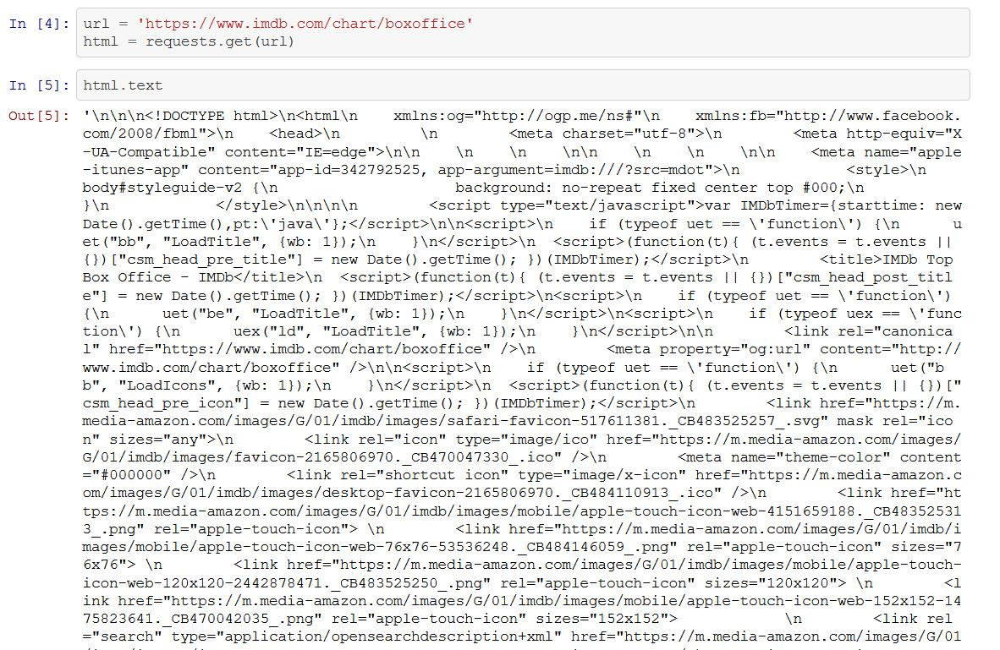
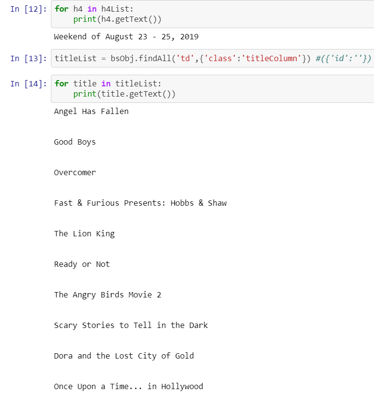
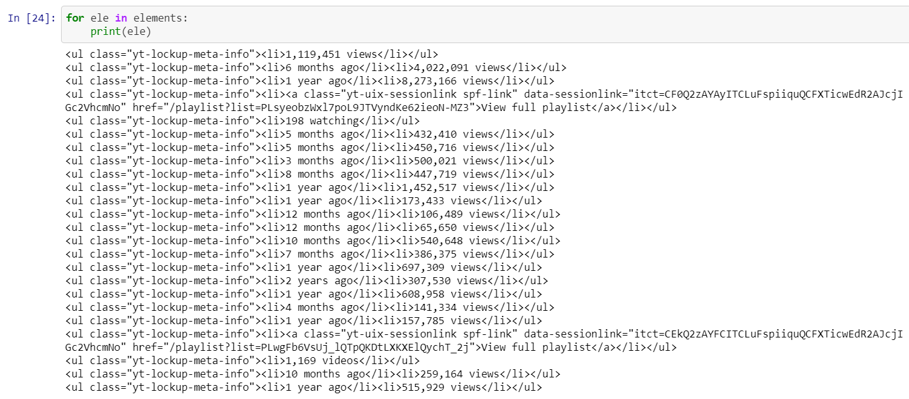
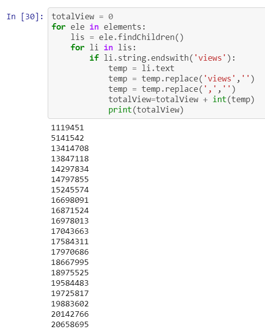

# Web-Scraping-on-Youtube
## Count total number of views for all videos on 1st page of Youtube for given keyword Keyword:Python

**Author**: SHAILESH DHAMA

### THEORETICAL DESCRIPTION :

Web Scraping is used to collect large information from websites.

Let’s look at the applications of Web Scraping:

    1.Price Comparison: Services such as ParseHub use web scraping to collect data from online shopping websites and use it to compare the prices of products.
    2.Email address gathering: Many companies that use email as a medium for marketing, use web scraping to collect email ID and then send bulk emails.
    3.Social Media Scraping: Web scraping is used to collect data from Social Media websites such as Twitter to find out what’s trending.
    4.Research and Development: Web scraping is used to collect a large set of data (Statistics, General Information, Temperature, etc.) from websites, which are analyzed and  used to carry out Surveys or for R&D.
    5.Job listings: Details regarding job openings, interviews are collected from different websites and then listed in one place so that it is easily accessible to the user.

### Business problem: 

    Web Scraping to count total number of views of all videos on 1st page of Youtube for given keyword Keyword:'Python'.

### Dataset : 

    Valid links of a webpage works as dataset in Web Scraping.

### Required Libraries :

    1.BeautifulSoup -  parsing information.
    2.requests -       requesting url to give the required information

## STEPS :

    - Scraping on IMDB using BeautifulSoup
    - Producing Top 5 overall box-office records by scraping
    - Scraping on Youtube for the given keyword 'Python'
    - Obtain total number of views of all videos on 1st Page of Youtube for 'Python' keyword.

## RESULTS :

#### Practicing Web Scraping on IMDB


> Raw Information obtained after requesting information from url.


> Top 10 movies with highest box-office records.

#### Web Scraping on Youtube to obtain total views


> Raw Information obtained after requesting information from url.


> Obtained Meta-Info elements of information.


> Total number of views for the videos with keyword "Python".

### For further information
Please review the narrative of our analysis in [our jupyter notebook](./WEB%20SCRAPING-MIN%20PROJECT.ipynb)

For any additional questions, please contact **shaileshshettyd@gmail.com)

##### Repository Structure:

```
├── README.md                           <- The top-level README for reviewers of this project.
├── WEB SCRAPING-MIN PROJECT.ipynb  <- narrative documentation of analysis in jupyter notebook
└── images                              <- both sourced externally and generated from code
```
